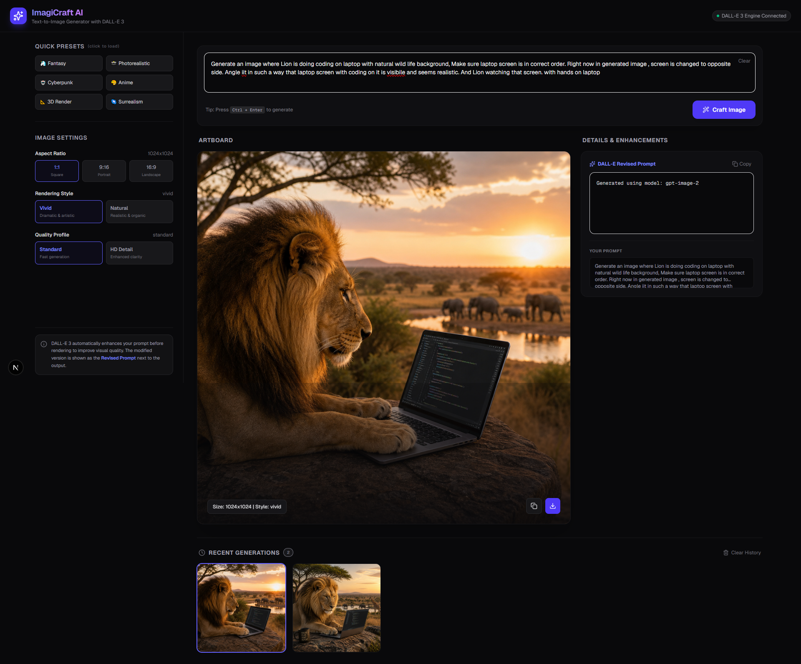

# ImagiCraft AI — Text-to-Image Generator

ImagiCraft AI is a modern, responsive full-stack Next.js application built using TypeScript, Tailwind CSS, and the OpenAI SDK to generate high-quality images. It utilizes the state-of-the-art **gpt-image-2** model with automatic parameter transformations and dynamic engine fallbacks.

---

## 🖥️ User Interface

Below is a screenshot of the ImagiCraft AI dashboard:



---

## 🎨 Example Generation

### Prompt Used
> "Generate an image where Lion is doing coding on laptop with natural wild life background, Make sure laptop screen is in correct order. Right now in generated image , screen is changed to opposite side. Angle it in such a way that laptop screen with coding on it is visible and seems realistic. And Lion watching that screen. with hands on laptop"

### Generated Output


---

## ✨ Features

- **Primary `gpt-image-2` Integration**: Automatically selects the most advanced image model active for your API key.
- **Dynamic Parameter Mapping**: Translates standard web inputs to model-specific parameter values (e.g. converting `hd`/`standard` qualities to `high`/`auto` and stripping unsupported `style` options for `gpt-image-2`).
- **Cascade Fallback System**: If `gpt-image-2` is not available, it automatically cascade-checks `chatgpt-image-latest`, `dall-e-3`, and finally `dall-e-2` to ensure your prompt is rendered under any circumstances.
- **Base64 & URL Support**: Automatically handles both remote hosted image URLs and raw Base64 data strings (`b64_json`) transparently.
- **Prompt Presets**: Contains interactive, pre-designed templates for diverse artistic styles (e.g., Cyberpunk, Fantasy, Anime, Photorealistic, 3D Render, Surrealism).
- **Aspect Ratio Control**: Supports Square (`1024x1024`), Portrait (`1024x1792`), and Landscape (`1792x1024`) rendering options.
- **Image Proxying & Native Downloading**: Safely pipes remote images through a server proxy to bypass browser CORS blocks, while natively downloading base64 inline images directly on the client.
- **Local History**: Preserves previous generations across sessions in the browser's `localStorage`.

---

## 🚀 Getting Started

### 1. Configure the Environment

Copy the example environment file:

```bash
cp .env.local.example .env.local
```

Open `.env.local` and add your OpenAI API Key:

```env
OPENAI_API_KEY=sk-proj-yourOpenAiApiKeyHere...
```

### 2. Run the Development Server

Start the Next.js development server:

```bash
npm run dev
```

Open [http://localhost:3000](http://localhost:3000) in your browser.

---

## 📂 Project Architecture

- **[`src/app/page.tsx`](file:///D:/Palwinder/text-to-image-generator/src/app/page.tsx)**: Main React dashboard.
- **[`src/app/api/generate/route.ts`](file:///D:/Palwinder/text-to-image-generator/src/app/api/generate/route.ts)**: API handler querying OpenAI with fallback routing.
- **[`src/app/api/proxy-image/route.ts`](file:///D:/Palwinder/text-to-image-generator/src/app/api/proxy-image/route.ts)**: Endpoint to proxy remote URLs for seamless CORS-free downloads.
- **[`src/app/globals.css`](file:///D:/Palwinder/text-to-image-generator/src/app/globals.css)**: Tailwind style definitions with custom dark colors.
